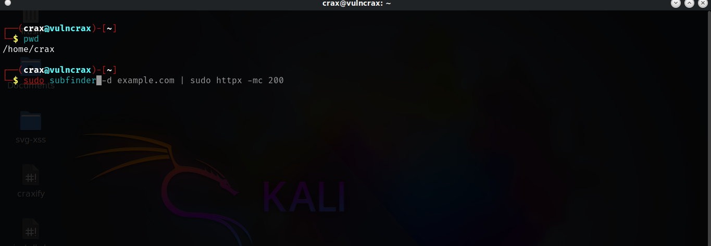

# parrot-zsh
Parrot auto-suggestion zsh shell 

# Parrot Os zsh auto-suggestion

 
# installion

   - `git clone https://github.com/vulncrax/my-zsh.git`
   - `cd my-zsh`
   - `bash install.sh`
   - `sudo chsh your_username -s /bin/zsh`
   - ` then restart your terminal`
